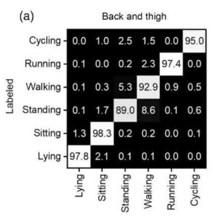

# Human Activity Recognition Using HARTH Dataset and Deep Learning
### Introduction
The purpose of this project is to explore the rapidly evolving field of Human Activity Recognition (HAR), specifically the application of machine learning algorithms. The evolution of wearable sensors, such as IMU units, has allowed for mass data collection surrounding human motion, and has thus opened the door for "data hungry" computational solutions to many problems surrounding human motion. 

Recently, machine learning algorithms have been gaining traction for HAR purposes, specifically deep neural network architectures, such as convolutional neural networks (CNN) and recurrent neural networks (RNN). These two architectures are especially relevant for HAR tasks due to their ability to interpret temporal patterns in time series data, such as those present in most human motion. The specific type of RNN that has shown the most success is the long short-term memory (LSTM) architecture, which is what I have used in this project.

### Dataset
The dataset used for this project is the The Human Activity Recognition Trondheim (HARTH) dataset. The HARTH dataset is a professionally-annotated dataset containing 22 subjects wearing two 3-axial accelerometers for around 2 hours in a free-living setting. The sensors were attached to the right thigh and lower back. The dataset contains 12 activities, however only the 6 most common were used for my analysis. The dataset download page and relevant literature can be found in the links below.

[HARTH Dataset Download](http://www.archive.ics.uci.edu/dataset/779/harth)

[_HARTH: A Human Activity Recognition Dataset for
Machine Learning_](https://www.semanticscholar.org/reader/dad0184602231aa82d4ed8c438cf0c18efba3e0e)

[_A Machine Learning Classifier for Detection of Physical Activity Types and Postures During Free-Living_](https://journals.humankinetics.com/view/journals/jmpb/5/1/article-p24.xml)

### Preprocessing
Firstly, the 6 activities that represented the least amount of time in the dataset were removed to ensure models would have enough training examples to generalize well and converge. Next, the data was split up into one second windows (50 samples) with labels assigned to these windows based on the most ocurring activity in each. For example, if one window contained 12 samples of activity 0 and 38 samples of activity 1, that window would be assigned one label of 1. This would leave the dataset as a set of n windows of size 6x50 where 6 represents readings from two triaxial accelerometers and 50 represents the amount of samples in each window. This 6x50 window would be assigned one integer value as its label.

### Model Architectures and Hyperparameters
| Model Architecture | Kernel Size     | Hidden Size | Fully Connected Size | Dropout Probability | LSTM Size |
|--------------------|-----------------|-------------|---------------|---------------------|-----------|
|CNN                 | 9, 3, 3         | 64, 64, 64  |256            | 0.2                 | N/A |
|Hybrid              | 9, 3, 3         | 64, 64, 64  | 256            | 0.3                 | 128 |

The "Hybrid" name refers to convolutional layers being followed by LSTM layer(s). Convolutional layers were kept identical to fairly compare performance between CNN and Hybrid architectures. The only change in hyperparameters was the slight increase in dropout rate for the Hybrid architecture due to this architecture's tendency to overfit to training data. Both models were trained with Cross-Entropy Loss and Adam optimizer (learning rate = 0.001).

### Initial Performance
The models already perform quite well with accuracy across classes ranging from 94-100% accuracy as we can see in Figure 1 & 2. Convergence also happens quite quickly as both models early stop at 13-14 epochs. The CNN overfits to training data slightly more than Hybrid, however both models seem to plateu around 98.3% overall accuracy, which is still very respectable (fig 1, 2).

    
    

<i>Figure 1 - Visualization of CNN performance in the form of loss curve, accuracy curve, and confusion matrix.</i>
  

    
    

<i>Figure 2 - Visualization of Hybrid (CNN + LSTM) performance in the form of loss curve, accuracy curve, and confusion matrix.</i>

### Class Balancing
As seen in Figure 3, this dataset is fairly imbalanced. To account for this imbalanced class distribution, three methods were used: weighted loss function, weighted random sampler, and downsampling. The dataset was downsampled by selecting samples until the number of samples from each class was equal to the amount of samples from the least occuring class of the entire dataset. Example: the original dataset contained 11649 running samples, so the downsampled dataset will contain 11649 samples of each activity.

    

<i>Figure 3 - Minutes spent on each activity for entire HARTH dataset to display class imbalance.</i>

### Results from Class Balancing

    
    

<i>Figure 4 - Visualization of Hybrid performance with the use of a weighted loss function.</i>
  

    
    

<i>Figure 5 - Visualization of Hybrid performance with the use of a weighted random sampler.</i>
  

    
    

<i>Figure 6 - Visualization of Hybrid performance with the use of downsampled dataset.</i>

### Discussion of Balancing Results
Unfortunately, the balancing methods did not lead to noticeable increases in performance, leading us to believe that any performance increases must be saught elsewhere. Some additional ideas to improve model performance include: hyperparameter optimization, raw signal filtering, experimenting with additional architectures, and different windowing techniques.

Although the balancing results may seem disappointing, a closer look at the models' performance across class distributions (as shown in Figure 3) suggests that addressing class imbalance may not have been the most effective way to improve overall accuracy. This is because the model performs the worst on the 1st and 3rd most common activities.

### Comparing Results to Literature
Figure 7 shows confusion matrices outlining performance of two XGBoost models and one CNN. The highest overall accuracies achieved from these papers are 95.07%, 78.89%, and 77.56% with respect to Figure 7. Comparing these figures with the figures generated from the project, it is clear that this project has achieved improved results. The highest overall accuracy achieved from one of my models was 98.34% (accuracy values accross models did not vary by more than 0.2%). This means that my process improved upon the literature by 3.27% - 20.78%.

    
    

<i>Figure 7 - Confusion matrices from the papers linked at the top of this file. Left was taken from: A Machine Learning Classifier for Detection of Physical Activity Types and Postures During Free-Living, right was taken from: HARTH: A Human Activity Recognition Dataset for Machine Learning. These specific figures were chosen as they are the best results from each paper.</i>

### Conclusion and Next Steps
After comparing these published confusion matrices to those generated by this notebook using my models, we can see that I have achieved equal or improved results for every activity. This is extremely promising for HAR tasks as my results show that simple preprocessing and model architectures can achieve state of the art results. This also provides evidence to suggest that proper dataset creation is the key to *free-living* HAR, and given a motivated team to create such a dataset, similar performance can be reached for a variety of activities.

Future HAR applications I would like to look into are specifically sports related HAR tasks. An example of this is in the paper: *An End-to-End Deep Learning Pipeline for Football Activity Recognition Based on Wearable Acceleration Sensors*. In this paper, Cuperman, Jansen, and Ciszewski show promising results for classifying more complex, shorter, and varying movements such as shots, jumps, and passes during soccer. Their highest accuracy metric was 98.25% and was achieved using a hybrid model similar to the one used in this project. This paper even takes classification a step further by breaking up their data into one second windows that slide across their data by one sample steps, predicting many labels for each timestep and ultimately concluding with the highest confidence classification. This is in comparisson to the strategy used in the project of a 25 sample sliding window step. This allows for classification of each timestep individually and independantly of the window it is contained in. This means that their strategy is far more precise when it comes to classifying shorter, non-periodic movements that occur so often in athletic activity.